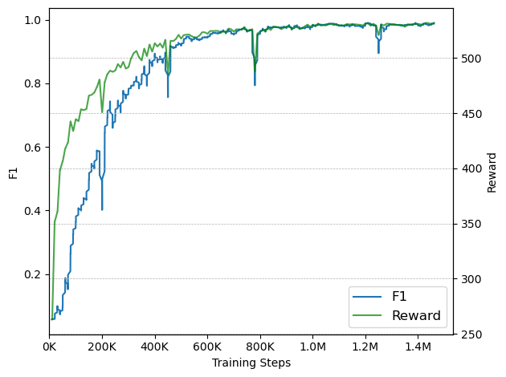

# RoboPianist Evaluation Repository

This repository provides an end-to-end training and evaluation pipeline for **RoboPianist**—the dexterous piano-playing agent introduced in the paper [RoboPianist: Dexterous Piano Playing with Deep Reinforcement Learning](https://arxiv.org/abs/2304.04150) by Kevin Zakka *et al.*. Unlike the official JAX implementation, this version is written in PyTorch to align with the majority of recent reinforcement-learning research. It was developed in the context of the **IN2107 – Seminar on Robotics Science and Systems Intelligence** at the Technical University of Munich (TUM).

---

## Overview

This repo adapts the original implementation (in JAX) to PyTorch and provides an easy-to-use training and evaluation pipeline:

1. **End-to-end quantitative evaluation** on the full **ROBOPIANIST-REPERTOIRE-150** dataset. [Evaluation.ipynb](Evaluation.ipynb)

2. **Out-of-domain test** on a “Golden Hour” by JVKE snippet of bars 7 & 9 and of a "Happy Birthday" snippet. [Evaluation_custom.ipynb](Evaluation_custom.ipynb)

---

## Features

- **PyTorch Implementation**: Complete policy model rewritten in PyTorch for compatibility and ease of integration with modern research.  
- **Single-Notebook Execution**: Each complete training and evaluation pipeline is in a single Jupyter notebook:
  - [Evaluation.ipynb](Evaluation.ipynb) for songs in the ROBOPIANIST-REPERTOIRE-150 dataset.  
  - [Evaluation_custom.ipynb](Evaluation_custom.ipynb) for the own created fingering annotated songs.  
    - Automated Fingering Integration: All file handling is contained within the notebook, requiring only the provided fingering file. ([golden_hour_fingering.txt](golden_hour_fingering.txt) & [happy_birthday_fingering.txt](happy_birthday_fingering.txt))

--- 

## Installation
1. **Clone the Repository**:
   ```bash
   git clone https://github.com/leongreiner/robopianist-evaluation.git
   cd robopianist-evaluation
   ```
2. **Initialize Submodules**:
   ```bash
   git submodule init && git submodule update
   ```
3. **Install Dependencies**:
   Follow the instructions in the Evaluation notebooks ([Evaluation.ipynb](Evaluation.ipynb) or [Evaluation_custom.ipynb](Evaluation_custom.ipynb)) to install all dependencies.

--- 

## Results
All results can be found in the [results](results) folder. The results are organized by song, with each song having its own subfolder containing the training metrics, plots and demo videos at different stages of the training. To have the actual sound included in the videos, you have to download them.

### Training Results: “Twinkle Twinkle”
- Total Training Steps: 1.46 million
- Total Training Time: 8h on a single NVIDIA A100 GPU




### Training Results: “Golden Hour”
- Total Training Steps: 2.76 million
- Total Training Time: 15h on a single NVIDIA A100 GPU


### Training Results: “Happy Birthday”
- Total Training Steps: X
- Total Training Time: X on a single NVIDIA A100 GPU


